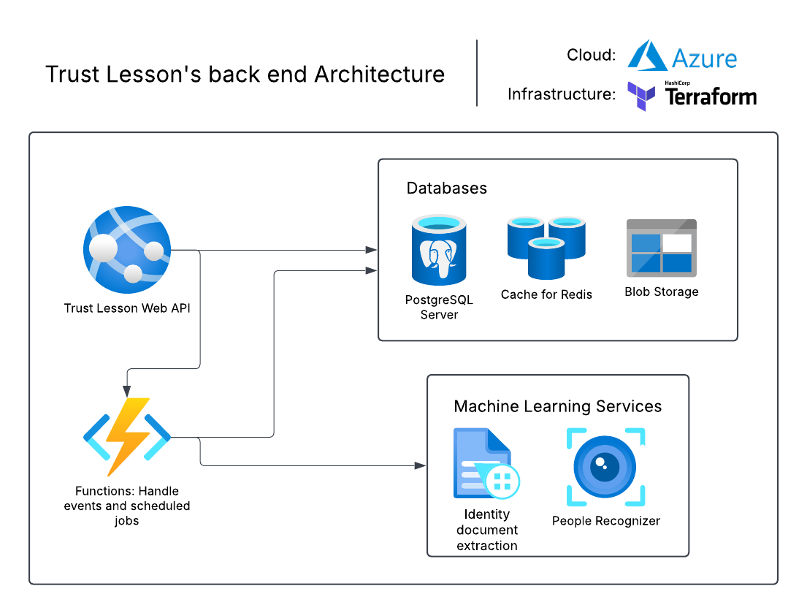

# :blue_book: Trust Lesson's back-end

    
    
    
    

Trust Lesson is a virtual learning environment, it's suitable to teach online courses which the lessons need to be synchronous and require to validate the presence of the tutee. 

> Recently, I had lessons to get my driver's license. The lessons were remotely through a meeting service. This service usually takes pictures of the students and later does a manual verification to check that the picture really shows a student watching the classes.
>
> So I had an idea 💡 : **It'd be awesome to create a similar system where human validation is done using computer vision, and I did.**

The project was developed considering scenarios when it's needed to prove that a certain student had watched the lessons, this proof is done by capturing pictures of the students and later validating the images using AI. An example of when this service can be used is when a company need to give a course to professionals who will work in a critical system, then it's needed to had legal garantee that the professionals participated fully of the course.

## :building_construction: Back-end Stack and Infrastructure

## :gear: API Setup

## :rocket: Back-end Deployment

## :handshake: Contributing

## :book: References

