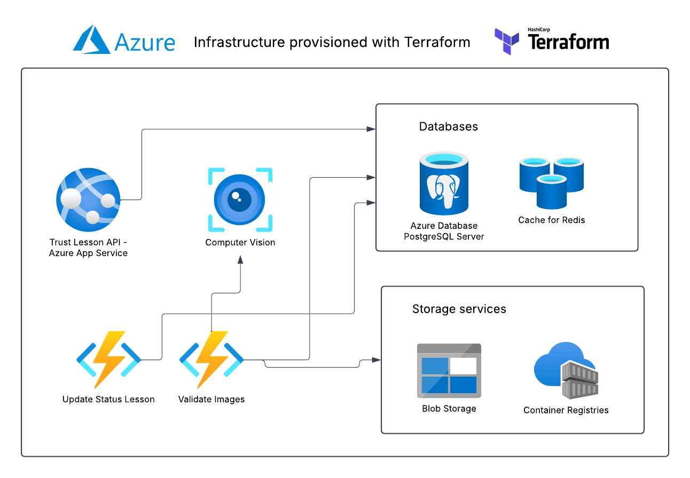

# :blue_book: Trust Lesson's back-end

<p align="center">
    <a href="https://github.com/raulpy271/trust-lesson/actions/workflows/tests.yml">
        
    </a>
    <a href="https://python-poetry.org/" target="_blank">
        
    </a>
    <a href="https://github.com/psf/black" target="_blank">
        
    </a>
    <a href="https://github.com/raulpy271/trust-lesson/" target="_blank">
        
    </a>
</p>

Trust Lesson is a virtual learning environment, it's suitable to teach online courses which the lessons need to be synchronous and require to validate the presence of the tutee. 

> Recently, I had lessons to get my driver's license. The lessons were remotely through a meeting service. This service usually takes pictures of the students and later does a manual verification to check that the picture really shows a student watching the classes.
>
> So I had an idea 💡 : **It'd be awesome to create a similar system where human validation is done using computer vision, and I did.**

The project was developed considering scenarios when it's needed to prove that a certain student had watched the lessons, this proof is done by capturing pictures of the students and later validating the images using AI. An example of when this service can be used is when a company need to give a course to professionals who will work in a critical system, then it's needed to had legal garantee that the professionals participated fully of the course.

## :building_construction: Back-end Stack and Infrastructure



One of the goals when creating this project was to use the best tools, especially ones that I want to improve my knowledge of. The main tools used are:

 - The web framework FastAPI to develop the API back-end.
 - PostgreSQL and Redis to store persistent and volatile data, respectively.
 - The ORM framework SQLAlchemy and the Alembic migration system.
 - Terraform to automate the infrastructure provisioning.
 - Azure Cloud to host the application and to provide some cloud services, like Azure App Services, Computer Vision models and Azure Functions.

Besides, the following tools are used in the development process:

 - Docker to build local images.
 - Poetry to install dependencies and build Python packages.
 - The Black and Flake8 package to enforce code style and check syntax errors.
 - Pytest to automatically run unit tests.
 - Postman to manually test the API.

## :gear: API Setup

An easy way to start working in the API is to set up a virtual environment and run the unit tests. The [Poetry](https://python-poetry.org/) package manager is used to install the dependencies and create a virtual environment.

With Poetry installed, the following commands install all dependencies, including the development dependencies:

```
# The command must be executed inside the api directory
poetry install with --dev
```

Now, it's possible to enter in the environment with all dependencies included:

```
poetry shell
```

The above command opens a shell inside a virtual environment, which includes the pytest library, the following commands run the unit tests:

```
# Run fastest tests
pytest -m "not slow"

# Run all tests
pytest
```

To make the test execution fast and run only the application code, the test runner uses a lightweight database(In memory SQLite), a fake Redis Client, and even doesn't start a web server.

### Application setup in Docker and Terraform

To run the application locally using a complete environment is used Terraform and Docker to create a collection of containers needed to create this environment. It will use three containers, a PostgreSQL database, a real Redis Server, and an HTTP Server.

The environment setup is made using Terraform, which will read the files `*-dev.tf` and will build the required Docker images, and will run the containers as well.

The below commands will build and run the containers in the local machine, they should be run in the root of the project but before that, verify that your system has Terraform and Docker installed and the latter is running.

```
# It will install the terraform back-end kreuzwerker/docker. Execute this command only in the first time
terraform init

# It will show what resources will be created
terraform plan

# It will create the resources after confirming with 'yes' 
terraform apply
```

After the last command, the environment will be created, run `docker ps` to see which containers are running, execute `docker logs api` to see the Web Server logs, and access `localhost:8000/docs/` to see the API routes and how to make requests to them.

To stop the containers run:

```
terraform destroy
```

## :rocket: Back-end Deployment

## :handshake: Contributing

## :book: References

